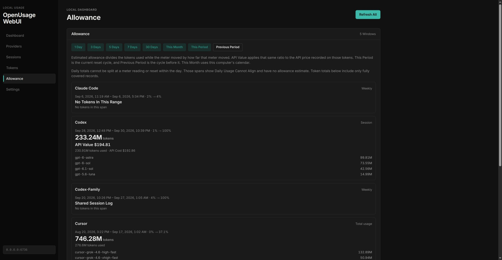
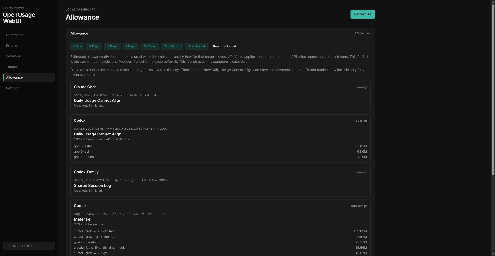

# Allowance Delivery Review

Date: 2026-10-01
Status: APPROVE for production revision and fee-only remediation.
Plan: `docs/plans/2026-10-01-allowance-delivery.md`
Previous repairs: `docs/fix-logs/2026-10-01-grok-session-fix-log.md`

## Scope And Gate

The user requested one independent review of the complete pull request before merge, then live data correction and restart. The previous three reviews covered 19 selected files; this pass covers the complete commit and the local data correction procedure. The new explicit request replaces the earlier no-commit instruction and the normal three-lane gate.

The feature branch starts from deployed `main` as a hotfix delivery. Existing regression fixtures and failing/passing evidence are retained; their original uncommitted state prevents reconstruction of separate red/green commits without fabricating history.

## Plugin Redaction Audit

Diffs checked: `plugins/claude/plugin.js`, `plugins/codex/plugin.js`, `plugins/cursor/plugin.js`.

- Claude adds numeric absolute usage and limit values beside an existing percent meter.
- Codex reads existing numeric `used_percent` and `limit_window_seconds` fields and preserves existing reset timestamps.
- Cursor exposes numeric dollar usage/limit and the literal unit `usd`.
- No new HTTP endpoint, credential, identity field or request body is introduced. `src-tauri/src/plugin_engine/host_api.rs:397` already lists token, access/refresh token, user/account/team/org identifiers and email keys. Existing redaction fixtures at lines 3460 onward cover those fields. No gap requiring a new redaction rule or test was found.

## Browser Evidence

Both screenshots use Previous Period with the same live database. The before capture uses the existing backend at port 6736; the after capture uses corrected code through a GET-only preview. The already-built frontend is shared by both, so the comparison isolates the estimator's behavior rather than claiming a full visual redesign.

## Live Correction Preflight

A consistent SQLite backup passed `PRAGMA integrity_check`. The first full daily reimport preflight rebuilt 212 records over 68 already-stored days, replacing 217 rows. Independent review rejected this operation: tokens fell from 14,590,612,368 to 12,567,215,520 and historical model/day scopes changed. Cause not determined. Date coverage and importer consistency do not justify these changes. This full-reimport procedure was not applied live and is superseded.

Evidence and scripts remain private under `docs/reviews/2026-10-01-delivery.local/`: `preflight.sqlite`, `codex-source.json`, `rewrite-codex.ts`, `rewrite-dry-run.json`. The first dry-run verification compared SQL NULL with the JSON text `null`; that verifier was corrected and the operation rerun on a fresh backup copy. No live data changed during preflight.

Before applying live, stop the exact inspected user service, take a fresh consistent backup and recollect local ccusage input. Limit correction to fee/provenance columns of rows identified in the original September price backup whose values have not subsequently changed. Use retained token components for estimates. Accept source-reported prices only when the corresponding model/token identity matches; day costs additionally require an identical complete day. Preserve unrelated providers, every model/token/date and observations. Restart runs existing v2 snapshot replay. Keep the previous September price backup as well. If post-write checks fail, keep the service stopped until the failure is repaired or the fresh backup is restored.

## Findings And Remediation

| Finding | Severity | Risk | In This Delivery | Decision |
| --- | --- | --- | --- | --- |
| Full daily reimport changes historical model/token totals without source evidence | High | Unexplained historical data loss | Yes | Replace scope deletion/reimport with transactional fee/provenance updates, checking an exact hash of every record's identity and token fields before commit. |

Production review target `193348cb4188e420aa1de29b314ab844c5dff6e9` received APPROVE from a fresh native verifier, requested GPT-6 Astra / medium. The reviewer reported 53 focused passes (zero failures) and inspected complete test/build evidence, screenshots and redaction fields. Runtime role was verifier with workspace-write sandbox; all review actions were read-only. Separate runtime model/effort metadata was unavailable.

Fee-only remediation preflight: 207 confirmed prior rewrite rows received provenance, including one changed price; two subsequently changed rows were skipped. Sources: 205 standard-rate and two reported-day. Hashes of all record identities/token fields and all non-Codex usage records were unchanged. Integrity check and per-row fee/provenance checks passed. Evidence: private `price-only-dry-run.json`; matching fix log: `docs/fix-logs/2026-10-01-allowance-delivery-fix-log.md`.

The same reviewer independently compared the original and fee-only database copies and returned APPROVE. Approved private script SHA256: `92327bc0658dd2c7ba0b95a01a8db67a482ac469ae2b7c2b8ce8624c1a6fe6cc`. Approval covers stopping the inspected service, fresh backup/source collection, applying the fee-only script and post-write verification. The production code approval remains unchanged. No unresolved blocking finding remains; operational records may be added without changing the approved code.
